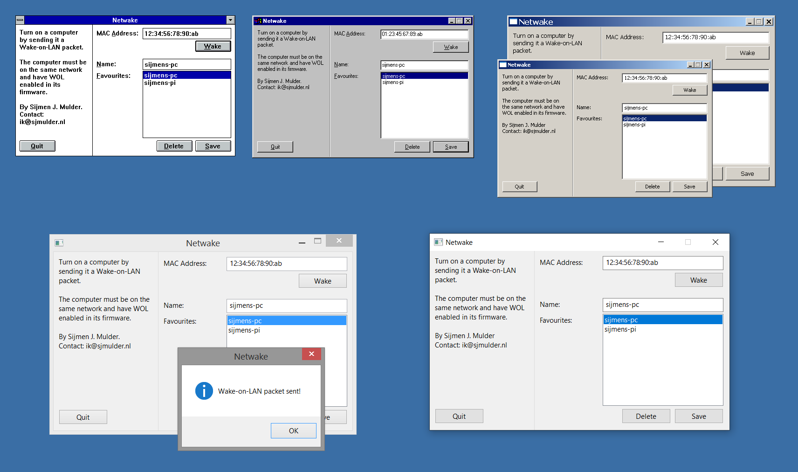

Netwake
=======
Simple Wake-on-LAN utility for Windows *all the way up from 3.11*.

(Depicted: Netwake on Windows 3.11, Windows 95, Windows XP with regular and
large fonts, Windows 8 at 150% DPI, Windows 10 at 150% DPI.)

Usage
-------
With Netwake, you can wake up a computer over the network using the Wake-on-LAN
protocol.

 1. Enable Wake-on-LAN on the target computer. Note the network card's MAC
    address.
 2. On another computer connected to the same network, run Netwake, enter the
    MAC address, and click Wake. The magic packet will be sent and the computer
    should wake up.

Problems? Missing features? Ideas? Open an issue!

Requirements
------------
Supports Windows 3.11 through 10, including all NT versions, with a single
.exe.

*Note*: on Windows 3.11, Win32s and Microsoft TCP/IP must be installed.

Why?
----
Apart from being potentially useful, the point of this utility was to try and
make a single Windows executable that runs *well* on as many Windows versions
as possible.

By running *well* I mean that the utility should work as well as any program
could be expected to on any of the support Windows version. For example:

 - Theme support ('visual styles') on Windows XP and up.
 - Large system font support (pre-Windows 10), including live changes.
 - High DPI support, including per-monitor high DPI support.
 - Storring settings in INI or the registry.
 - The usual things: keybindings, localisation, etc.

Consider it a small homage to Windows' backwards *and* forwards compatibility.

How?
----
A 32-bit Intel binary is the obvious choice as that's supported on Windows 95
and NT up through 10, including 64-bit Intel devices as well as 64-bit ARM
devices using Windows' built-in emulation layer.

Even Windows 3.11 supports 32-bit applications through the Win32s add-on.

The canonical executable is built using mingw-w64, which places no artificial
Windows version requirements on the binary. The standard C library isn't quite
universal however, hence it is not used or linked.

Functionality that is specific to newer Windows versions, like DPI functions
or the newer common control library used for visual styles, is loaded
dynamically with *LoadLibrary()*.

Winsock 1.1 (*wsock32.dll*) is used instead of the later Winsock 2
(*ws2_32.dll*) which isn't available on Windows 3.11.

Building
--------
The canonical executable is built using mingw-w64. There's a Makefile in
*win/* which can also build a floppy image (useful for virtual machines).

Additionally a Visual C++ 6 workspace and Visual Studio 2019 solution are
included for easy development but those don't produce the same super compatible
sort of binary the Makefile does.

Roadmap
-------
I'd like to do a macOS version as well with the same goal but newer macOS SDKs
don't support targeting older versions, and binaries built against older SDKs
don't work well on modern versions.

But there is an interesting alternative approach: building a universal binary
consisting of PowerPC, Intel and ARM versions that were each built separately
against different versions of the SDK.

A Linux version could also be interesting - that would likely involve a static
binary dynamically loading different versions of toolkits.

Author
------
Sijmen J. Mulder (<ik@sjmulder.nl>)