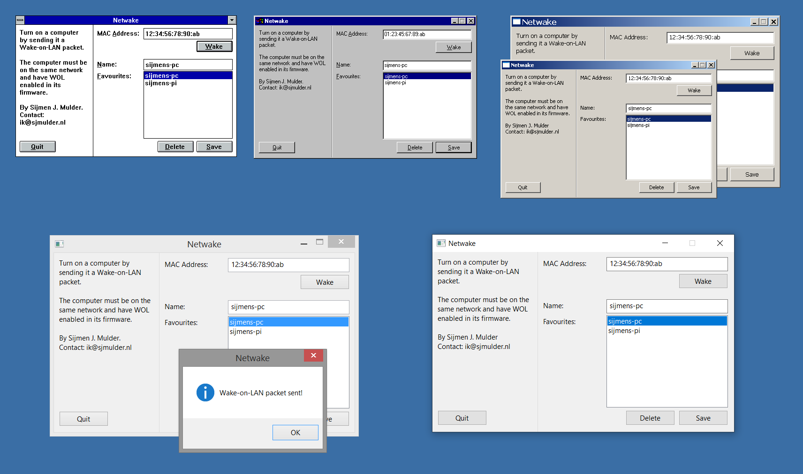

Netwake
=======
Simple Wake-on-LAN utility for Windows *all the way up from 3.11*, plus
a cross-platform command-line interface.

(Depicted: Netwake on Windows 3.11, Windows 95, Windows XP with regular
and large fonts, Windows 8 at 150% DPI, Windows 10 at 150% DPI.)

**[Windows version](win32/)**

**[Command-line version](cli/)**

Author
------
Sijmen J. Mulder (<ik@sjmulder.nl>)
