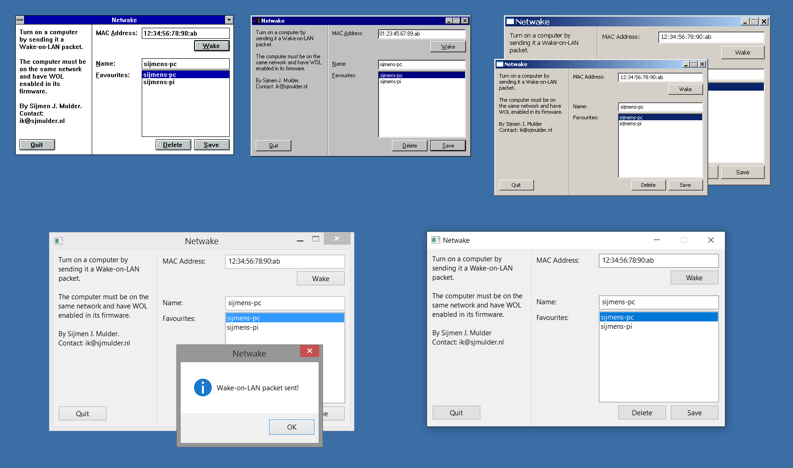

Netwake for Windows
===================
Simple Wake-on-LAN utility for Windows *all the way up from 3.11*.

(Depicted: Netwake on Windows 3.11, Windows 95, Windows XP with regular
and large fonts, Windows 8 at 150% DPI, Windows 10 at 150% DPI.)

**[Other versions](https://github.com/sjmulder/netwake)**

Usage
-------
With Netwake, you can wake up a computer over the network using the
Wake-on-LAN protocol.

 1. Enable Wake-on-LAN on the target computer. Note the network card's
    MAC address.
 2. Download Netwake from the
    [Releases](https://github.com/sjmulder/netwake/releases) page.
 3. On another computer connected to the same network, run Netwake,
    enter the MAC address, and click Wake. The magic packet will be
    sent and the computer should wake up.

Problems? Missing features? Ideas? File an
[issue](https://github.com/sjmulder/netwake/issues)!

Requirements
------------
Supports Windows 3.11 through 10, including all NT versions, with a
single .exe.

*Note*: on Windows 3.11, Win32s and Microsoft TCP/IP must be installed.

Why?
----
Apart from being potentially useful, the point of this utility was to
try and make a single Windows executable that runs *well* on as many
Windows versions as possible.

By running *well* I mean that the utility should work as well as any
program could be expected to on any of the support Windows version. For
example:

 - Theme support ('visual styles') on Windows XP and up.
 - Large system font support (pre-Windows 10), including live changes.
 - High DPI support, including per-monitor high DPI support.
 - Storring settings in INI or the registry.
 - The usual things: keybindings, localisation, etc.

Consider it a small homage to Windows' backwards *and* forwards
compatibility.

How?
----
A 32-bit Intel binary is the obvious choice as that's supported on
Windows 95 and NT up through 10, including 64-bit Intel devices as well
as 64-bit ARM devices using Windows' built-in emulation layer.

Even Windows 3.11 supports 32-bit applications through the Win32s
add-on.

The canonical executable is built using mingw-w64, which places no
artificial Windows version requirements on the binary. The standard C
library isn't quite universal however, hence it is not used or linked.

Functionality that is specific to newer Windows versions, like DPI
functions or the newer common control library used for visual styles,
is loaded dynamically with *LoadLibrary()*.

Winsock 1.1 (*wsock32.dll*) is used instead of the later Winsock 2
(*ws2_32.dll*) which isn't available on Windows 3.11.

Building
--------
The canonical executable is built using mingw-w64. There's a Makefile in
this directory which can also build a floppy image (useful for virtual
machines).

Additionally a Visual C++ 6 workspace and Visual Studio 2019 solution
are included for easy development but those don't produce the same super
compatible sort of binary the Makefile does.

Author
------
Sijmen J. Mulder (<ik@sjmulder.nl>)
